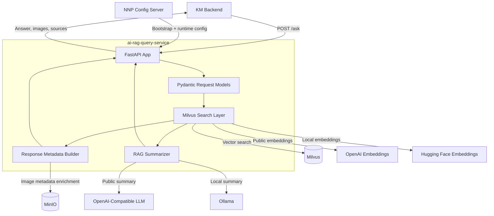
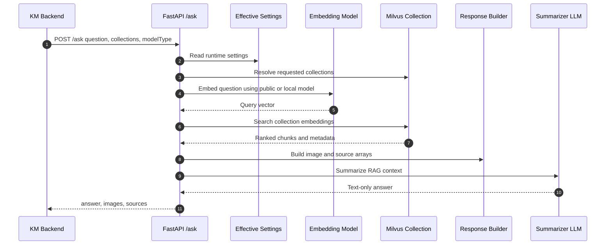

# ai-rag-query-service

[](https://www.python.org/)
[](https://fastapi.tiangolo.com/)
[](https://milvus.io/)
[](https://platform.openai.com/)
[](https://www.docker.com/)

FastAPI microservice that receives natural-language questions, searches Milvus
vector collections for relevant knowledge chunks, summarizes the retrieved
context with a public or local LLM, and returns answer text, source metadata,
and image asset metadata to the Knowledge Management backend.

Part of the **Nubo Native Platform (NNP)** RAG and Knowledge Management flow.

---

## Table of Contents

- [Overview](#overview)
- [Key Features](#key-features)
- [Architecture & Low-Level Design (LLD)](#architecture--low-level-design-lld)
  - [System Component Architecture](#system-component-architecture)
  - [RAG Query Flow](#rag-query-flow)
- [Technology Stack](#technology-stack)
- [Quick Start & Local Development](#quick-start--local-development)
  - [Prerequisites](#prerequisites)
  - [Configuration Setup](#configuration-setup)
  - [Running Locally](#running-locally)
  - [Running via Docker](#running-via-docker)
- [Configuration Reference](#configuration-reference)
- [API Documentation](#api-documentation)
- [Project Structure](#project-structure)
- [Image Asset Handling](#image-asset-handling)
- [Security & Compliance](#security--compliance)
- [Contributing & Community](#contributing--community)
- [License](#license)

---

## Overview

`ai-rag-query-service` acts as the retrieval and answer-generation layer for
NNP knowledge workflows. It accepts a question from the KM backend, embeds the
query, searches one or more Milvus collections, builds source and image
metadata, and generates a text-only answer using either:

1. A public OpenAI-compatible model path.
2. A local model path using Hugging Face embeddings and Ollama chat models.

The service does not expose browser-facing MinIO signed URLs. Instead, it
returns image asset metadata such as `bucket`, `object_key`, `doc_name`, and
`page_number`. The KM backend converts that metadata into its own asset
streaming endpoint for frontend use.

---

## Key Features

1. **RAG Query API**
   - Exposes `POST /ask` for question answering over configured knowledge
     collections.
   - Returns answer text, source metadata, and image metadata in a single
     response.

2. **Milvus Vector Search**
   - Supports one or more requested collection names.
   - Falls back to configured default public or local collections when no valid
     collection is provided.
   - Applies source count and similarity threshold controls per request.

3. **Public and Local Model Modes**
   - Uses OpenAI-compatible embeddings and chat models for `modelType=public`.
   - Uses Hugging Face embeddings and Ollama chat models for `modelType=local`.
   - Supports optional request-level summarizer model and API key overrides.

4. **Config Server Integration**
   - Loads canonical runtime configuration from the NNP config server.
   - Allows controlled local overrides through `.env` during development.
   - Validates required configuration during application startup.

5. **Source and Image Metadata Handling**
   - Extracts document source details from retrieved chunk metadata.
   - Enriches figure image metadata for downstream KM backend image streaming.
   - Keeps generated answers text-only so image rendering stays explicit and
     controlled by the API response contract.

---

## Architecture & Low-Level Design (LLD)

### System Component Architecture



### RAG Query Flow



---

## Technology Stack

| Component | Technology | Version / Spec |
| :--- | :--- | :--- |
| **Runtime** | Python | 3.13+ |
| **Web Framework** | FastAPI | 0.128+ |
| **ASGI Server** | Uvicorn | 0.40+ |
| **Vector Database** | Milvus / PyMilvus | 2.6+ |
| **Public Embeddings** | OpenAI-compatible embeddings | Configured by `EMBEDDING_MODEL` |
| **Local Embeddings** | LangChain Hugging Face embeddings | Configured by `LOCAL_EMBEDDING_MODEL` |
| **Public Summarization** | OpenAI-compatible chat completion | Configured by `RAG_SUMMARIZER_PUBLIC_LLM` |
| **Local Summarization** | Ollama chat API | Configured by `RAG_SUMMARIZER_LOCAL_LLM` |
| **Object Storage Metadata** | MinIO | Used for image asset metadata |
| **Configuration** | NNP config server + `.env` overrides | Profile and tag based |
| **Containerization** | Docker | Python 3.13 slim base image |

---

## Quick Start & Local Development

### Prerequisites

- **Python 3.13+** installed.
- **Milvus** reachable from the service.
- **MinIO** reachable when image metadata enrichment is required.
- **NNP config server** reachable, unless running with local fallback settings.
- **Ollama** available when using `modelType=local`.
- **OpenAI API key** available when using public embeddings or public
  summarization.

### Configuration Setup

Create a local environment file from the sample:

```bash
copy .env.sample .env
```

Required bootstrap values:

```env
CONFIG_SERVER_URL=http://<config-server-host>:<config-server-port>/<config-path>
CONFIG_APP_NAME=ai-rag-query-service
CONFIG_PROFILE=main
CONFIG_TAG=v1
CONFIG_SERVER_TIMEOUT=5
CONFIG_SERVER_REQUIRED=true
ALLOW_LOCAL_CONFIG_OVERRIDES=true
APP_ENV=dev
```

`ALLOW_LOCAL_CONFIG_OVERRIDES=true` is intended for local development. When it
is enabled, any non-empty runtime value in `.env` overrides the value fetched
from the config server. Leave a key blank to keep the config-server value.

Example local overrides:

```env
MILVUS_HOST=<milvus-host>
MILVUS_PORT=<milvus-port>
OLLAMA_BASE_URL=http://<ollama-host>:<ollama-port>
```

### Running Locally

Create and activate a virtual environment:

```bash
python -m venv .venv
.venv\Scripts\activate
pip install -r requirements.txt
```

Start the service:

```bash
uvicorn main:app --host 0.0.0.0 --port 8000 --reload
```

If the KM backend is also running locally on port `8000`, run this service on a
different port and point the backend `RAG_QUERY_SERVICE_URL` to that port:

```bash
uvicorn main:app --host 0.0.0.0 --port 8001 --reload
```

Health check:

```bash
curl http://localhost:8000/
```

### Running via Docker

Build the image:

```bash
docker build -t ai-rag-query-service .
```

Run the container:

```bash
docker run --env-file .env -p 8000:8000 ai-rag-query-service
```

---

## Configuration Reference

The canonical runtime values come from the config server. Keys may be stored in
dotted notation in the config table, but they are normalized and exposed to the
service as environment-style names such as `MILVUS_HOST`.

The application validates required configuration during startup. Missing
required values prevent the FastAPI app from starting.

| Environment Variable | Description |
| :--- | :--- |
| `CONFIG_SERVER_URL` | NNP config server base URL. |
| `CONFIG_APP_NAME` | Config server application name, usually `ai-rag-query-service`. |
| `CONFIG_PROFILE` | Config profile, such as `main` or `dev`. |
| `CONFIG_TAG` | Config label or tag, such as `v1`. |
| `CONFIG_SERVER_TIMEOUT` | Config server request timeout in seconds. |
| `CONFIG_SERVER_REQUIRED` | Whether startup must fail if config server fetch fails. |
| `ALLOW_LOCAL_CONFIG_OVERRIDES` | Allows non-empty local `.env` runtime values to override config server values. |
| `APP_ENV` | Runtime environment name returned by the health endpoint. |
| `RAG_SERVICE_APP_NAME` | Service name returned by the health endpoint. |
| `OPENAI_API_KEY` | Default public model and embedding API key. |
| `EMBEDDING_MODEL` | Public embedding model name. |
| `EMBEDDING_DIMENSION` | Expected public embedding vector size. |
| `LOCAL_EMBEDDING_MODEL` | Hugging Face model used for local embeddings. |
| `MILVUS_HOST` | Milvus host. |
| `MILVUS_PORT` | Milvus port. |
| `MILVUS_DB_NAME` | Milvus database name. |
| `MILVUS_COLLECTION_NAME` | Default collection for public embeddings. |
| `MILVUS_COLLECTION_NAME_LOCAL` | Default collection for local embeddings. |
| `OLLAMA_BASE_URL` | Base URL for local Ollama summarization. |
| `RAG_SUMMARIZER_PUBLIC_LLM` | Default public summarizer model. |
| `RAG_SUMMARIZER_LOCAL_LLM` | Default local summarizer model. |
| `GET_SUMMARY_TIMEOUT_LOCAL` | Timeout in seconds for summarization requests. |
| `RAG_SUMMARY_MAX_WORDS` | Maximum answer length used in prompt rendering. |
| `RAG_ONLY_SYSTEM_PROMPT` | Prompt template for RAG-only answers. |
| `RAG_WITH_PUBLIC_INFO_SYSTEM_PROMPT` | Prompt template for RAG plus general-knowledge answers. |
| `PUBLIC_INFO_ONLY_SYSTEM_PROMPT` | Prompt template used when no RAG context is found and public info is allowed. |
| `MINIO_HOST` | MinIO host used for image asset metadata. |
| `MINIO_ROOT_USER` | MinIO access user. |
| `MINIO_ROOT_PASSWORD` | MinIO access password. |
| `MINIO_SECURE` | Whether MinIO should use HTTPS. |
| `MINIO_BUCKET` | Default image asset bucket. |
| `MINIO_PRESIGNED_URL_EXPIRY_SECONDS` | Expiry duration for generated internal asset references where applicable. |

---

## API Documentation

Once the service is started, FastAPI exposes interactive API documentation:

- **Swagger UI**: [http://localhost:8000/docs](http://localhost:8000/docs)
- **ReDoc**: [http://localhost:8000/redoc](http://localhost:8000/redoc)
- **OpenAPI JSON**: [http://localhost:8000/openapi.json](http://localhost:8000/openapi.json)
- **Health Endpoint**: [http://localhost:8000/](http://localhost:8000/)

### `GET /`

Returns service health and environment information.

Example response:

```json
{
  "app": "ai-rag-query-service",
  "env": "dev",
  "status": "OK"
}
```

### `POST /ask`

Request body:

```json
{
  "question": "How do I configure knowledge base search?",
  "collectionNames": ["ai_knowledge_base_embeddings"],
  "sourceCount": 3,
  "similarityThreshold": 0.0,
  "extendPublicInfo": true,
  "modelType": "public",
  "ModelName": null,
  "APIKey": null
}
```

Response body:

```json
{
  "answer": [
    {
      "score": 1.0,
      "text": "Summarized answer text.",
      "metadata": null,
      "source": null,
      "doc_type": null,
      "collection": null
    }
  ],
  "images": [
    {
      "url": "",
      "asset_id": "figure-asset-id",
      "bucket": "knowledge-assets",
      "object_key": "path/to/image.png",
      "doc_name": "source-document.pdf",
      "page_number": 2
    }
  ],
  "sources": [
    {
      "score": 0.86,
      "source": "source-document.pdf",
      "doc_type": "pdf",
      "collection": "ai_knowledge_base_embeddings",
      "doc_name": "source-document.pdf",
      "page_number": 2
    }
  ]
}
```

---

## Project Structure

```text
.
|-- main.py                         # FastAPI app, request/response models, routes
|-- src/
|   |-- core/
|   |   |-- config.py               # Effective app settings and validation
|   |   |-- config_server.py        # Config server bootstrap and local overrides
|   |   `-- milvus_vectorstore.py   # Embedding and Milvus search logic
|   `-- services/
|       |-- minio_storage.py        # Image asset enrichment helpers
|       |-- rag_response_builder.py # Source and image response shaping
|       `-- rag_summarizer.py       # Public/local LLM summarization
|-- Dockerfile
|-- requirements.txt
|-- pyproject.toml
`-- .env.sample
```

---

## Image Asset Handling

This service does not send browser-facing signed MinIO URLs. It returns image
metadata such as `bucket`, `object_key`, `doc_name`, and `page_number`. The KM
backend rewrites that metadata into its own `/manageKnowledge/assets/image`
endpoint and streams the image to the frontend.

LLM-generated answers are explicitly instructed not to include markdown image
syntax, invented URLs, or placeholder image links. Images are returned only in
the `images` array.

---

## Security & Compliance

This repository should follow the same security posture as other NNP services:

- **Zero Committed Secrets**: Do not commit `.env`, API keys, MinIO passwords,
  tokens, private keys, or internal-only credentials.
- **Config Hygiene**: Keep canonical runtime values in the config server and
  use local overrides only for development.
- **Request Secret Handling**: Keep request-level `APIKey` values out of logs.
- **Dependency Review**: Review Python dependencies in `requirements.txt`,
  `pyproject.toml`, and `uv.lock` before upgrading.
- **Container Hygiene**: Build reproducible Docker images and avoid baking
  environment-specific secrets into the image.

---

## Contributing & Community

Contributions should follow the repository documentation set as it is added:

- Guidelines: [CONTRIBUTING.md](CONTRIBUTING.md)
- Code of Conduct: [CODE_OF_CONDUCT.md](CODE_OF_CONDUCT.md)
- Development Guide: [DEVELOPMENT_GUIDELINES.md](DEVELOPMENT_GUIDELINES.md)
- Deployment & User Manual: [USER_MANUAL_AND_DEPLOYMENT_GUIDE.md](USER_MANUAL_AND_DEPLOYMENT_GUIDE.md)
- Security Policy: [SECURITY.md](SECURITY.md)
- Maintainers: [MAINTAINERS.md](MAINTAINERS.md)

---

## License

A license file is not currently present in this repository. Add the intended
project license before public distribution or external contribution intake.
