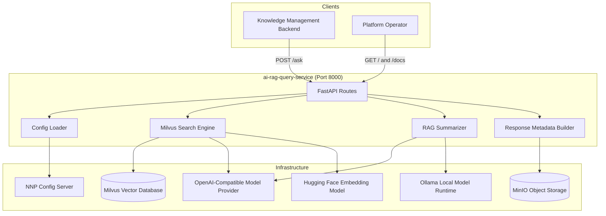

# User Manual and Deployment Guide: `ai-rag-query-service`

Enterprise operations, architectural workflows, configuration management, and
deployment instructions for **`ai-rag-query-service`**.

---

## Table of Contents

1. [Architecture & System Overview](#1-architecture--system-overview)
2. [Runtime Prerequisites](#2-runtime-prerequisites)
3. [Configuration Reference](#3-configuration-reference)
4. [Deployment Strategies](#4-deployment-strategies)
   - [Local & Standalone Deployment](#local--standalone-deployment)
   - [Docker Deployment](#docker-deployment)
   - [Kubernetes Production Deployment](#kubernetes-production-deployment)
5. [Operational Health & Observability](#5-operational-health--observability)
6. [Troubleshooting & FAQs](#6-troubleshooting--faqs)

---

## 1. Architecture & System Overview

`ai-rag-query-service` is the retrieval and answer-generation microservice for
NNP Knowledge Management RAG workflows. The KM backend calls this service with a
question and optional collection controls. The service searches Milvus, builds
source and image metadata, summarizes the retrieved context, and returns a
structured response.



### Key Functional Responsibilities

1. **Question Answering API**:
   - Accepts a user question through `POST /ask`.
   - Supports optional collection, source count, similarity threshold, model
     mode, model name, and API key overrides.

2. **Milvus Retrieval**:
   - Resolves requested collection names against Milvus.
   - Uses configured public or local default collections when no valid
     collection is supplied.
   - Sorts matching chunks by score and returns the best results.

3. **Public and Local Model Paths**:
   - Uses OpenAI-compatible embeddings and chat completions for public mode.
   - Uses Hugging Face embeddings and Ollama chat models for local mode.

4. **Source and Image Metadata Response**:
   - Builds a `sources` array from chunk metadata.
   - Builds an `images` array for figure assets when metadata includes usable
     image references.
   - Keeps generated answers text-only.

5. **Config Server Based Runtime Management**:
   - Loads canonical runtime values from the config server.
   - Allows controlled local `.env` overrides during development.
   - Validates required config values during startup.

---

## 2. Runtime Prerequisites

| Component | Minimum Version | Recommended | Notes |
| :--- | :--- | :--- | :--- |
| **Python Runtime** | 3.13 | 3.13.x | Container image uses `python:3.13-slim` |
| **FastAPI / Uvicorn** | See dependency files | Current repo dependency set | Runs the HTTP API on port `8000` |
| **Milvus** | 2.x | 2.6+ | Stores vectorized knowledge chunks |
| **MinIO** | S3-compatible | Current platform standard | Used for image asset metadata |
| **Config Server** | Platform managed | Current NNP config service | Required when `CONFIG_SERVER_REQUIRED=true` |
| **Ollama** | Current supported version | Current platform standard | Required for `modelType=local` summarization |
| **OpenAI-Compatible API** | Current supported API | Current platform standard | Required for public embeddings or public summarization |
| **Docker Engine** | 20.10+ | 24+ | Required for container build/run validation |

---

## 3. Configuration Reference

Configuration is loaded in two stages:

1. Bootstrap values are read from environment variables or `.env`.
2. Runtime values are fetched from the config server and optionally overridden
   by non-empty local values when `ALLOW_LOCAL_CONFIG_OVERRIDES=true`.

Example local `.env` shape:

```env
# Config server bootstrap
CONFIG_SERVER_URL=http://<config-server-host>:<config-server-port>/<config-path>
CONFIG_APP_NAME=ai-rag-query-service
CONFIG_PROFILE=<config-profile>
CONFIG_TAG=<config-label-or-tag>
CONFIG_SERVER_TIMEOUT=5
CONFIG_SERVER_REQUIRED=true
ALLOW_LOCAL_CONFIG_OVERRIDES=true

# Runtime identity
APP_ENV=<environment-name>
RAG_SERVICE_APP_NAME=ai-rag-query-service

# Public model provider
OPENAI_API_KEY=<public-model-api-key>
EMBEDDING_MODEL=<public-embedding-model>
EMBEDDING_DIMENSION=<embedding-dimension>
RAG_SUMMARIZER_PUBLIC_LLM=<public-summary-model>

# Local model provider
LOCAL_EMBEDDING_MODEL=<local-embedding-model>
OLLAMA_BASE_URL=http://<ollama-host>:<ollama-port>
RAG_SUMMARIZER_LOCAL_LLM=<local-summary-model>
GET_SUMMARY_TIMEOUT_LOCAL=<summary-timeout-seconds>
RAG_SUMMARY_MAX_WORDS=<max-summary-words>

# Milvus
MILVUS_HOST=<milvus-host>
MILVUS_PORT=<milvus-port>
MILVUS_DB_NAME=<milvus-database-name>
MILVUS_COLLECTION_NAME=<public-embedding-collection>
MILVUS_COLLECTION_NAME_LOCAL=<local-embedding-collection>

# MinIO image asset metadata
MINIO_HOST=<minio-host>
MINIO_ROOT_USER=<minio-user>
MINIO_ROOT_PASSWORD=<minio-password>
MINIO_SECURE=<true-or-false>
MINIO_BUCKET=<asset-bucket>
MINIO_PRESIGNED_URL_EXPIRY_SECONDS=<expiry-seconds>

# Prompt templates
RAG_ONLY_SYSTEM_PROMPT=<rag-only-system-prompt-template>
RAG_WITH_PUBLIC_INFO_SYSTEM_PROMPT=<rag-plus-public-info-system-prompt-template>
PUBLIC_INFO_ONLY_SYSTEM_PROMPT=<public-info-only-system-prompt-template>
```

### Important Configuration Notes

- `CONFIG_SERVER_URL` must use a placeholder in documentation and a real value
  only in protected runtime configuration.
- `OPENAI_API_KEY`, `MINIO_ROOT_PASSWORD`, and request-level `APIKey` values are
  secrets and must not be committed or logged.
- `MILVUS_COLLECTION_NAME` and `MILVUS_COLLECTION_NAME_LOCAL` should point to
  collections built with matching embedding dimensions.
- `ALLOW_LOCAL_CONFIG_OVERRIDES=true` is intended for local development. For
  managed environments, prefer config server values and secret stores.

---

## 4. Deployment Strategies

### Local & Standalone Deployment

Create a virtual environment and install dependencies:

```bash
python -m venv .venv
.venv\Scripts\activate
pip install -r requirements.txt
```

Create local configuration:

```bash
copy .env.sample .env
```

Populate `.env` with local-only values or placeholders, then start the service:

```bash
uvicorn main:app --host 0.0.0.0 --port 8000 --reload
```

Health check:

```bash
curl http://localhost:8000/
```

Interactive API documentation:

```text
http://localhost:8000/docs
```

### Docker Deployment

Build the image:

```bash
docker build -t ai-rag-query-service .
```

Run the container with an environment file:

```bash
docker run --env-file .env -p 8000:8000 ai-rag-query-service
```

The container starts:

```bash
uvicorn main:app --host 0.0.0.0 --port 8000
```

### Kubernetes Production Deployment

Below is a deployment template. Replace placeholders with environment-specific
ConfigMap, Secret, image, namespace, and resource values managed by the
deployment platform.

```yaml
apiVersion: apps/v1
kind: Deployment
metadata:
  name: ai-rag-query-service
  namespace: <namespace>
  labels:
    app.kubernetes.io/name: ai-rag-query-service
    app.kubernetes.io/part-of: nubo-native-platform
spec:
  replicas: <replica-count>
  selector:
    matchLabels:
      app: ai-rag-query-service
  template:
    metadata:
      labels:
        app: ai-rag-query-service
    spec:
      containers:
        - name: ai-rag-query-service
          image: <registry>/<image-name>:<image-tag>
          imagePullPolicy: IfNotPresent
          ports:
            - containerPort: 8000
              name: http
          envFrom:
            - configMapRef:
                name: <config-map-name>
            - secretRef:
                name: <secret-name>
          resources:
            requests:
              cpu: <request-cpu>
              memory: <request-memory>
            limits:
              cpu: <limit-cpu>
              memory: <limit-memory>
          readinessProbe:
            httpGet:
              path: /
              port: 8000
            initialDelaySeconds: 20
            periodSeconds: 10
          livenessProbe:
            httpGet:
              path: /
              port: 8000
            initialDelaySeconds: 30
            periodSeconds: 15
---
apiVersion: v1
kind: Service
metadata:
  name: ai-rag-query-service
  namespace: <namespace>
spec:
  type: ClusterIP
  selector:
    app: ai-rag-query-service
  ports:
    - port: 8000
      targetPort: 8000
      name: http
```

---

## 5. Operational Health & Observability

- **Health Endpoint**: `GET /` returns application name, environment, and
  status.
- **Swagger UI**: `GET /docs` provides interactive API documentation.
- **OpenAPI JSON**: `GET /openapi.json` exposes the generated OpenAPI schema.
- **Startup Validation**: Missing required config values fail startup with a
  clear missing-key list.
- **Operational Logs**: Logs should identify config loading, collection
  resolution, model path, retrieved chunk count, and summarization status
  without exposing secrets.

Example health response:

```json
{
  "app": "ai-rag-query-service",
  "env": "<environment-name>",
  "status": "OK"
}
```

Example `/ask` request:

```json
{
  "question": "How does the knowledge search workflow work?",
  "collectionNames": ["<collection-name>"],
  "sourceCount": 3,
  "similarityThreshold": 0.0,
  "extendPublicInfo": true,
  "modelType": "public",
  "ModelName": null,
  "APIKey": null
}
```

---

## 6. Troubleshooting & FAQs

### Q: The service fails during startup with missing configuration values.

**A**: The service validates required runtime values during import/startup.
Check the config server payload and any local overrides. Ensure required keys
exist for Milvus, model providers, MinIO, prompts, and runtime identity.

### Q: The service cannot fetch config from the config server.

**A**: Verify `CONFIG_SERVER_URL`, `CONFIG_APP_NAME`, `CONFIG_PROFILE`,
`CONFIG_TAG`, and network access from the runtime environment. For local
development only, set `CONFIG_SERVER_REQUIRED=false` if you have supplied all
required runtime values locally.

### Q: Milvus returns no search results.

**A**: Confirm that the requested collection exists, the selected `modelType`
matches the collection embedding type, and `similarityThreshold` is not too
high. Also verify that the query embedding dimension matches the collection
`embedding` field dimension.

### Q: A collection is skipped during search.

**A**: The service skips collections when the query embedding dimension does not
match the collection schema. Use the matching public or local collection for
the selected model path.

### Q: Public summarization fails.

**A**: Confirm that `OPENAI_API_KEY` and `RAG_SUMMARIZER_PUBLIC_LLM` are set in
the runtime configuration. If the request supplies `APIKey`, ensure it is valid
for the requested `ModelName`.

### Q: Local summarization fails.

**A**: Confirm that `OLLAMA_BASE_URL` is reachable and that
`RAG_SUMMARIZER_LOCAL_LLM` or the request-level `ModelName` is available in the
local Ollama runtime.

### Q: Images are not returned.

**A**: Images are returned only when retrieved chunk metadata contains figure
assets with usable `object_key` values. Confirm the source ingestion pipeline
stores image metadata in the expected shape and that `MINIO_BUCKET` is
configured when chunk metadata does not include a bucket.

### Q: The generated answer contains no summary.

**A**: If summarization fails, the service may return raw RAG results or a
fallback message depending on available context. Check provider connectivity,
model names, API keys, and timeout settings.
